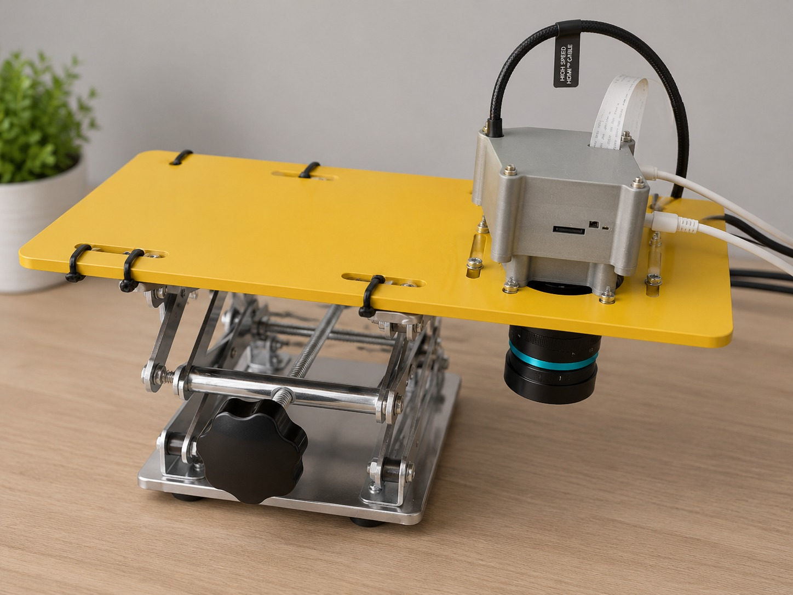

<div align="center">

# Raspberry Pi Crystal Detection Rig

### Embedded AI · Camera Lab Jack · YOLOv8 on-device

[](https://github.com/MeharAbdulla/adjustable-vision-capture-rig)
[](https://github.com/MeharAbdulla/adjustable-vision-capture-rig)
[](https://github.com/MeharAbdulla/adjustable-vision-capture-rig)
[](https://github.com/MeharAbdulla/adjustable-vision-capture-rig)



Lab-jack height platform + downward camera for **crystal / particle detection** with **Raspberry Pi embedded AI** (YOLO + OpenCV).

</div>

**Build window:** 3 Aug – 2 Sep 2026 (portfolio documentation)

## What this is

A height-adjustable vision station for stable top-down imaging. The Pi (or USB camera host) captures frames; a YOLOv8 model detects crystal-like objects for counting, QC, or dataset labeling.

| Layer | Role |
| --- | --- |
| Mechanical | Lab jack / scissor lift + yellow mount plate |
| Capture | Pi Camera / USB camera, HDMI or CSI path |
| Edge AI | YOLOv8 inference on Raspberry Pi |
| Tools | Preview grab + detect CLI |

## Features

- Adjustable working distance for macro / tray / dish imaging
- OpenCV preview and sample frame export
- YOLOv8 crystal detection CLI (swap in your fine-tuned `weights/best.pt`)
- Upwork-safe: no live credentials in the repo

## Bill of materials

- Raspberry Pi (4 / 5 recommended for YOLO)
- Pi Camera Module or USB webcam
- Lab jack / scissor lift
- Mounting plate and cable management
- Optional: HDMI capture / display for live QA

## Quick start (Raspberry Pi)

```bash
python -m venv .venv
source .venv/bin/activate   # Windows: .venv\Scripts\activate
pip install -r requirements.txt

# Grab a preview frame from camera 0
python src/capture_preview.py --source 0 --out media/sample_capture.jpg

# Run crystal detection (uses yolov8n.pt by default; replace with your weights)
python src/detect_crystals.py --source media/prototype.jpg --weights yolov8n.pt --save
```

Fine-tuned crystal model:

```bash
python src/detect_crystals.py --source 0 --weights weights/best.pt --conf 0.35 --save
```

## Project layout

```text
media/                 # prototype photo + sample frames
src/capture_preview.py # camera / file preview
src/detect_crystals.py # YOLOv8 detection CLI
weights/               # put best.pt here (gitignored except .gitkeep)
docs/                  # notes
```

## Safety

Never commit real API keys or device passwords. See [UPWORK-SHARE.md](UPWORK-SHARE.md).
