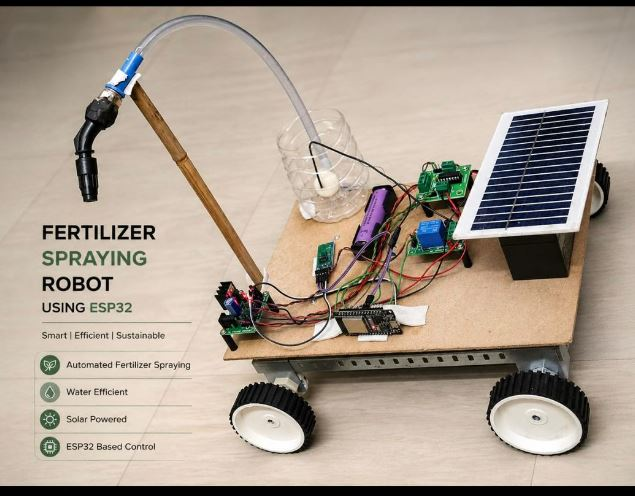

# ESP32 Fertilizer Spraying Robot



Solar-assisted four-wheel prototype that drives a spray pump via relay for efficient fertilizer delivery — Smart | Efficient | Sustainable.

**Build window:** 3 Aug – 2 Sep 2026 (portfolio documentation)

## Features

- Prototype-faithful pin map and BOM
- Upwork-safe: no live Wi-Fi / MQTT credentials in the repo
- Example secrets template only (`secrets.example.h`)

## Bill of materials

- ESP32 DevKit
- 4WD chassis + motor driver
- Relay module + submersible pump
- Spray nozzle + reservoir
- Solar panel + 18650 pack

## Pin map

| Signal | ESP32 GPIO |
|---|---|
| Motor IN1..IN4 | 26, 27, 14, 12 |
| Pump relay | 25 |
| Status LED | 2 |

## Flash / run

```bash
cd firmware
cp secrets.example.h secrets.h   # then edit locally
pio run -t upload
pio device monitor
```

## Safety

Never commit `secrets.h`. See the repo root [UPWORK-SHARE.md](../../UPWORK-SHARE.md).
