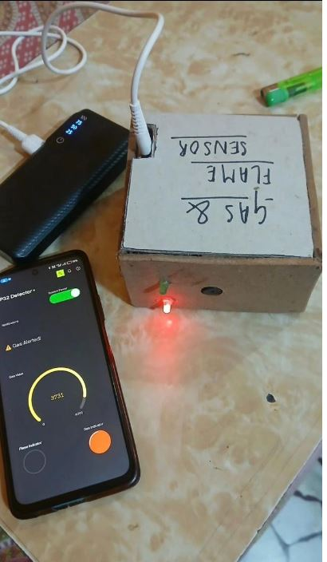

# ESP32 Gas & Flame Safety Detector



Battery-powered cardboard-prototype safety node that streams MQ gas ADC and flame digital state to a simple mobile-style gauge UI over Wi-Fi.

**Build window:** 3 Aug – 2 Sep 2026 (portfolio documentation)

## Features

- Prototype-faithful pin map and BOM
- Upwork-safe: no live Wi-Fi / MQTT credentials in the repo
- Example secrets template only (`secrets.example.h`)

## Bill of materials

- ESP32 DevKit
- MQ-2 / MQ-5 gas sensor
- IR flame sensor
- Status LED + buzzer
- USB power bank

## Pin map

| Signal | ESP32 GPIO |
|---|---|
| Gas analog | 34 |
| Flame digital | 27 |
| LED | 2 |
| Buzzer | 25 |

## Flash / run

```bash
cd firmware
cp secrets.example.h secrets.h   # then edit locally
pio run -t upload
pio device monitor
```

## Safety

Never commit `secrets.h`. See the repo root [UPWORK-SHARE.md](../../UPWORK-SHARE.md).
