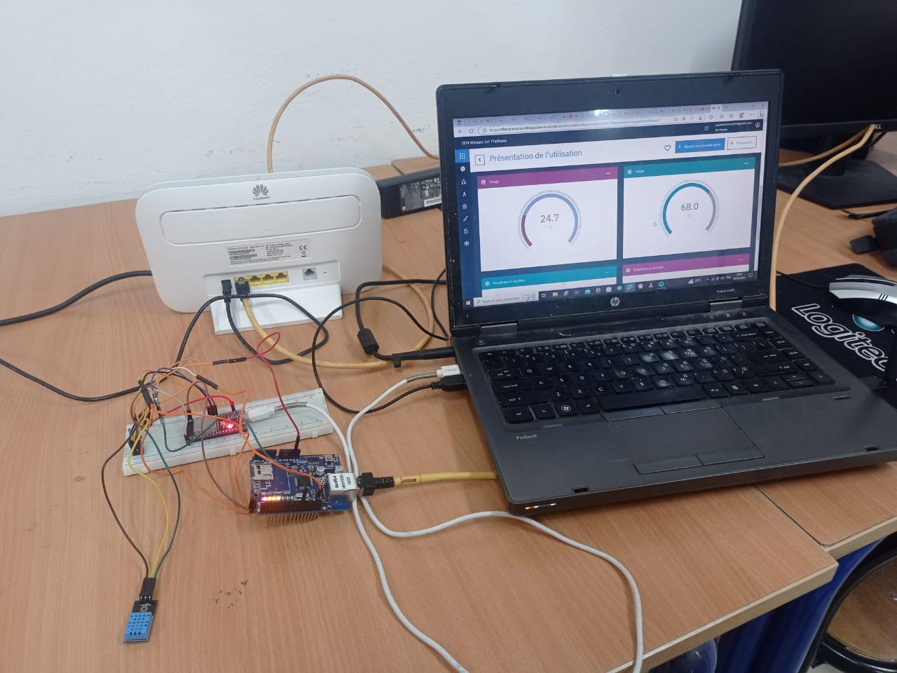

# ESP32 Home Assistant MQTT Monitor



Temperature & humidity node publishing DHT readings over MQTT for Home Assistant / Node-RED style gauges.

**Build window:** 3 Aug – 2 Sep 2026 (portfolio documentation)

## Features

- Prototype-faithful pin map and BOM
- Upwork-safe: no live Wi-Fi / MQTT credentials in the repo
- Example secrets template only (`secrets.example.h`)

## Bill of materials

- ESP32 (or ESP8266) DevKit
- DHT11 / DHT22
- Wi-Fi router
- MQTT broker (Mosquitto / HA)

## Pin map

| Signal | GPIO |
|---|---|
| DHT data | 4 |

## Flash / run

```bash
cd firmware
cp secrets.example.h secrets.h   # then edit locally
pio run -t upload
pio device monitor
```

## Safety

Never commit `secrets.h`. See the repo root [UPWORK-SHARE.md](../../UPWORK-SHARE.md).
