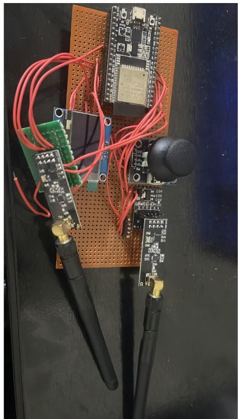

# ESP32 Dual-nRF24 Joystick Remote



Handheld long-range controller: ESP32 + dual nRF24L01 PA/LNA modules, OLED status, and analog joystick — built for drone / rover teleop experiments.

**Build window:** 3 Aug – 2 Sep 2026 (portfolio documentation)

## Features

- Prototype-faithful pin map and BOM
- Upwork-safe: no live Wi-Fi / MQTT credentials in the repo
- Example secrets template only (`secrets.example.h`)

## Bill of materials

- ESP32 DevKit
- 2x nRF24L01+ PA/LNA
- 0.96" SSD1306 OLED (I2C)
- Analog joystick module
- Perfboard + wiring

## Pin map

| Signal | ESP32 GPIO |
|---|---|
| OLED SDA / SCL | 21 / 22 |
| Joystick X / Y / SW | 34 / 35 / 32 |
| nRF CE / CSN (radio A) | 4 / 5 |
| nRF CE / CSN (radio B) | 16 / 17 |
| shared SPI | VSPI (18/19/23) |

## Flash / run

```bash
cd firmware
cp secrets.example.h secrets.h   # then edit locally
pio run -t upload
pio device monitor
```

## Safety

Never commit `secrets.h`. See the repo root [UPWORK-SHARE.md](../../UPWORK-SHARE.md).
