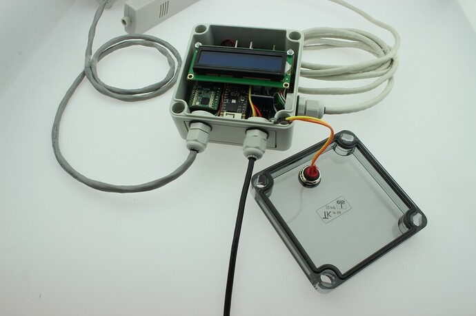

# IP66 Field Monitor Node



Rugged waterproof enclosure with local 16x2 LCD for outdoor / industrial sensing — cable glands, sealed lid, field-ready wiring.

**Build window:** 3 Aug – 2 Sep 2026 (portfolio documentation)

## Features

- Prototype-faithful pin map and BOM
- Upwork-safe: no live Wi-Fi / MQTT credentials in the repo
- Example secrets template only (`secrets.example.h`)

## Bill of materials

- Arduino Nano / ESP32
- 16x2 LCD (I2C backpack)
- IP66 junction box + glands
- External probe cable

## Pin map

| Signal | Pin |
|---|---|
| LCD SDA / SCL | A4 / A5 (Nano) or 21 / 22 (ESP32) |
| Probe analog | A0 |

## Flash / run

```bash
cd firmware
cp secrets.example.h secrets.h   # then edit locally
pio run -t upload
pio device monitor
```

## Safety

Never commit `secrets.h`. See the repo root [UPWORK-SHARE.md](../../UPWORK-SHARE.md).
