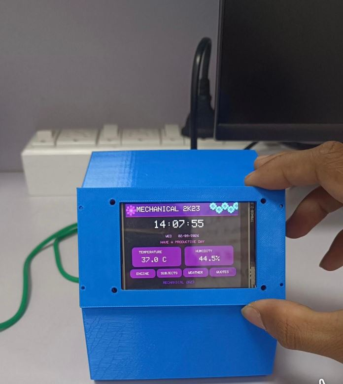

# Mechanical 2K23 Desk Assistant



Blue 3D-printed TFT desk companion showing clock, climate, and menu tiles (Engine / Subjects / Weather / Quotes).

**Build window:** 3 Aug – 2 Sep 2026 (portfolio documentation)

## Features

- Prototype-faithful pin map and BOM
- Upwork-safe: no live Wi-Fi / MQTT credentials in the repo
- Example secrets template only (`secrets.example.h`)

## Bill of materials

- ESP32
- Color TFT (ILI9341 class)
- DHT11/22
- 3D-printed enclosure
- Optional speaker

## Pin map

| Signal | Notes |
|---|---|
| TFT | Configure via TFT_eSPI User_Setup |
| DHT | GPIO 4 |

## Flash / run

```bash
cd firmware
cp secrets.example.h secrets.h   # then edit locally
pio run -t upload
pio device monitor
```

## Safety

Never commit `secrets.h`. See the repo root [UPWORK-SHARE.md](../../UPWORK-SHARE.md).
