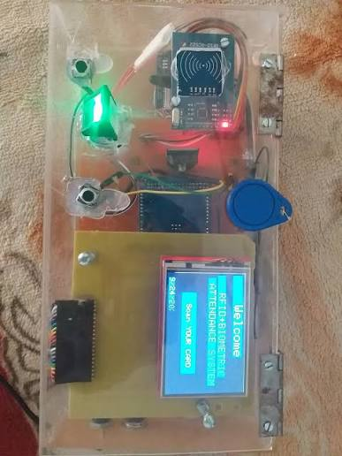

# RFID + Biometric Attendance Kiosk



Acrylic-enclosed attendance station with RC522 reader and OLED prompts — scan card, log UID, ready for fingerprint module expansion.

**Build window:** 3 Aug – 2 Sep 2026 (portfolio documentation)

## Features

- Prototype-faithful pin map and BOM
- Upwork-safe: no live Wi-Fi / MQTT credentials in the repo
- Example secrets template only (`secrets.example.h`)

## Bill of materials

- Arduino / ESP32
- RC522 RFID module
- RFID tags
- OLED / LCD
- Acrylic enclosure
- Optional fingerprint sensor

## Pin map

| Signal | Pin (ESP32) |
|---|---|
| RC522 SS / RST | 5 / 4 |
| SPI | 18 / 19 / 23 |
| OLED I2C | 21 / 22 |

## Flash / run

```bash
cd firmware
cp secrets.example.h secrets.h   # then edit locally
pio run -t upload
pio device monitor
```

## Safety

Never commit `secrets.h`. See the repo root [UPWORK-SHARE.md](../../UPWORK-SHARE.md).
