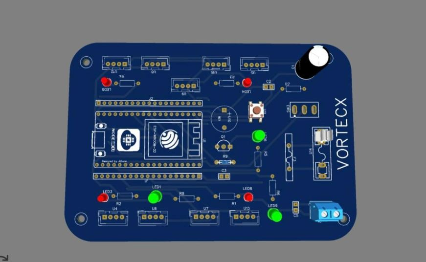

# Vortex-class ESP32 Dev Board — Bring-up Firmware



Board bring-up sketches for a Vortex-style ESP32 module board (LEDs, buttons, GPIO headers). PCB artwork attribution remains with the original designer; this repo covers firmware only.

**Build window:** 3 Aug – 2 Sep 2026 (portfolio documentation)

## Features

- Prototype-faithful pin map and BOM
- Upwork-safe: no live Wi-Fi / MQTT credentials in the repo
- Example secrets template only (`secrets.example.h`)

## Bill of materials

- Vortex-class ESP32 board
- USB cable
- Optional peripherals on headers

## Pin map

| Feature | Typical |
|---|---|
| Status LEDs | board silkscreen LED1..LED9 |
| User button | SW3 |
| ESP module | ESP-WROOM-32 |

## Flash / run

```bash
cd firmware
cp secrets.example.h secrets.h   # then edit locally
pio run -t upload
pio device monitor
```

## Safety

Never commit `secrets.h`. See the repo root [UPWORK-SHARE.md](../../UPWORK-SHARE.md).
