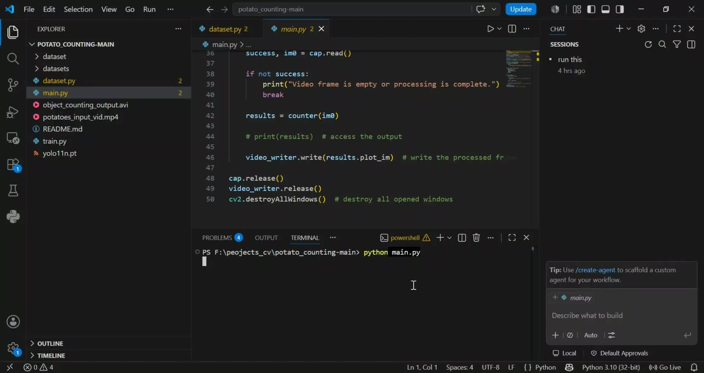

# YOLOv8 Potato Counter



Count potatoes on a tray or conveyor for yield sampling and packing QC.

**Build window:** 3 Aug – 2 Sep 2026 (portfolio documentation)  
**Paper notes:** see [docs/paper-summary.md](docs/paper-summary.md)

## Quick start

```bash
python -m venv .venv
# Windows: .venv\Scripts\activate
pip install -r requirements.txt
python src/infer.py --source media/demo-frame.jpg --weights yolov8n.pt --save --count-class potato
```

Place fine-tuned weights in `weights/best.pt` and pass `--weights weights/best.pt` for domain accuracy.

## Project layout

- `src/infer.py` — detection / counting CLI
- `media/demo-frame.jpg` — frame extracted from local demo video
- `docs/paper-summary.md` — method summary from source report
- `weights/` — put checkpoints here (ignored by git except `.gitkeep`)

## Notes

For belt video, consider adding a tracker later to avoid double-counts. Full demo video available on request.

## Upwork-safe

No API keys or private datasets are included. See [UPWORK-SHARE.md](../../UPWORK-SHARE.md).
